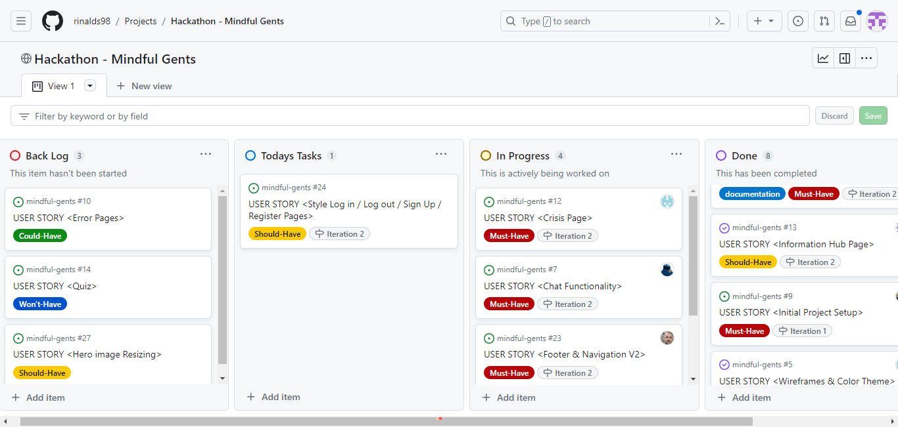
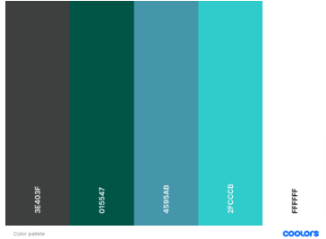
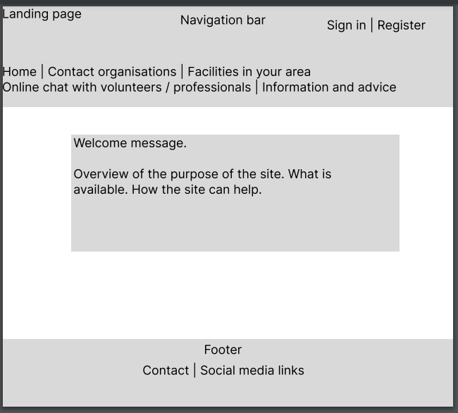
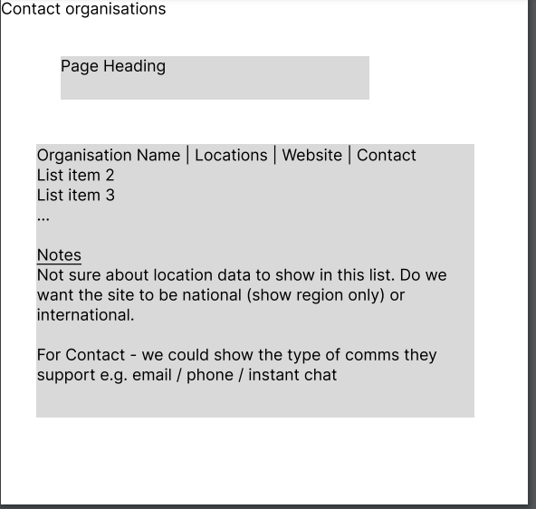
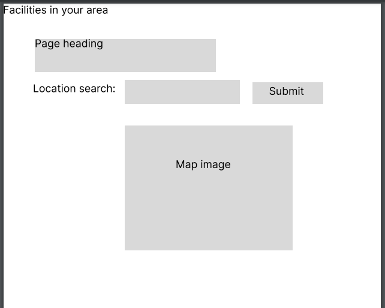
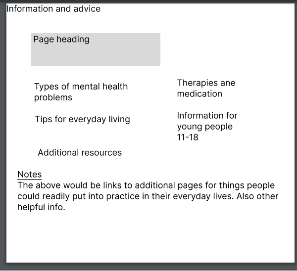
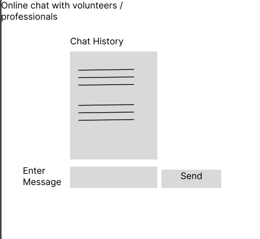

<h1 align="center">
<strong>
Mindful-Gents
 </strong>
 </h1>

# SUBMISSION

## Deployment

This project is deployed and can be accessed at (https://mindful-gents-1abd5af4698b.herokuapp.com/)

## Criteria

In this section, we will briefly discuss how our team addressed the applicable criteria:

 - Project is 100% Front End and Back End.
 - Project must have home page, crisis and information hub.
 - Project must have chat option for volunters, professional and users looking to chat.
 - Basic Readme.md in place
 - Use Frameworks such as env.py, urls.py, js.
  

 # ABOUT SUBMISSION
  

 ## Introduction
    
  Mindful Gents  aims to offers a discreet and confidential chat service designed to support the 75% of men who may find it challenging to discuss their mental health with friends or family. Our professional volunteers are available to lend a compassionate ear, providing a safe space for open conversations. We hope that our users will utilise our anonymous chat function to express thoughts and feelings without judgment or disclosure. Your well-being matters, and at Mindful Gents, we're committed to fostering a supportive community for men seeking assistance in navigating their mental health journey.

 ## Goals

   The team goals is to create a site with the following functionalies.

  * Website app with Chat Functionality and crisis response.
  * Emergency hotlines and website.
  * Information of what to do in certain situations ie. stress/anxiety with help.
  * Simple layout (3 pages) homepage with hero photos and call to action buttons.
  * Anonymous chat function to express thoughts
  * App that offer support for men seeking assistance in navigating their mental health journey.

## User Stories

* As a user, I want to be able to log into the website and browse through the navbar and fimd imformation 
 easily.

* As a user, I  want sign up for any  resources and information that I might be interested in.

* As a user, I want to view hero images and content on the site that encourage men to look after their    menntal health.

*As a user, Iwant to see  resources and the impact of community involvement in men's mental health.

* As a user, I want to view the information-hub about the event and staticstic of men mental health and 
  how to get support.

* As a user, I want to upload my trash collected to keep track of the waste on the shores and review my impact over time.

* As a user, I want to be able to navigate to a 'contact us' page so that I can find 'Mindful-gent's chat features and login details.

 

## Design

  The criteria suggested a site where men with experiencing mental health crisis can seek support we made sure the colour and visuals are attrative.

  ### Color Design
  
  

  ### Visual Design
  
   
  
## Typography
 
 *  The font chosen for the site was Source Sans 3 - a Sans Serif font. It was picked from Google Fonts 
    as we wanted an easy to read font that was inviting for a user to continue reading and browsing throughout the site.  

## Imagery
 * Team Logo was created using [Logo](https://logo.com/)
    * Logo was designed to incorporate bright colorway using [Logo](https://logo.com/)
    
  * Background Images All images used throughout site are royalty free and sourced from 
    [Logo](https://logo.com/)
  
  * Pixel Art
     * The pixel art was designed using [pixel art](https://www.pixilart.com)
  * Front page 
     * The images were takenfrom [Logo](https://logo.com/)
  * Favicon
     * Favicon was created using [Logo](https://logo.com/)
     
  *  Api/Maps was created using [here develper](https://developer.here.com/)

  * Maps and crisis services content were gotten from [Mind](https://www.mind.org.uk/)

## Controls

 ### Version Control

 * [Github](https://github.com/) used to host repository.
 * [Heroku](https://www.heroku.com/) used to deploy the website.

 * [VScode](https://code.visualstudio.com/) is  free and open-source code editor and customizable tool 
   for writing code.

## Wireframes
 [Figma](www.figma.com) is a cloud-based design and prototyping tool that is widely used for creating user interfaces (UI) and user experience (UX) designs.

      
    
   

## Technology Used
  
* HTML5
* CSS3
* Bootstrap
* JavaScript
* Django
* Python
* API
* Heroku

  
  ## Local Deployment

 - In order to make a local copy of this project, you can clone it.
 - In your IDE Terminal, type the following command to clone our repository:
 -  git clone (https://github.com/rinalds98/mindful-gents)

## Testing

The site was tested on the following browsers: 
- Firefox
- Chrome
- Safari
- Microsoft Edge

## Bugs and fixes

 - Changes to Chat model - caused issues with migration - solution delete database and migrate again.

## Programs Used
 
 ### Code Editors

* [Codeanywhere](https://app.codeanywhere.com/) used to develop project and organise version control.
* [Gitpod](https://gitpod.io/) used to develop project and organise version control.
* [VScode](https://code.visualstudio.com/) free and open-source code editor for writing code.
* [Heroku](https://www.heroku.com/) used to deploy the website.
  
### Libraries

 * [StackOverflow](https://stackoverflow.com/) used to problem solve and deal with queries.
 * [ChatGPT](https://chat.openai.com/) used to generate ideas and to verify code.

### Communications

* [Slack](https://slack.com/intl/en-ie/) A collaboration platform designed to facilitate efficient 
   communication and teamwork within organizations, teams, and communities.

## Credits
  
  **Thank you to all the team members for the hard work and cooperation.**
  
 - **Rinalds Zimelis** [GitHub](https://github.com/rinalds98), [LinkedIn](https://www.linkedin.com/in/rinalds-zimelis/)  
  Scrum Master/ Frontend / Backend/ Documentation
  
 - **Ant_4P**[GitHub](https://github.com/ant2210) [LinkedIn]()
  Frontend / Backend/ Documentation
  
 - **Jonathan Wenn_5p** [GitHub](https://github.com/jw-coder84/) [LinkedIn](https://www.linkedin.com/in/jonathanwenn/)
  Frontend / Backend/ Documentation
  
- **Koko-66_alum** [GitHub](https://github.com/Koko-66) [LinkedIn](https://www.linkedin.com/in/k-c-n)
  Frontend / Backend/ Documentation
  
- **O.Esther** [GitHub](https://github.com/57Esther) [LinkedIn]( https://www.linkedin.com/in/oluwaseun-olawunmi-adeoye-862a56225/)
  Frontend / Documentation.
  
